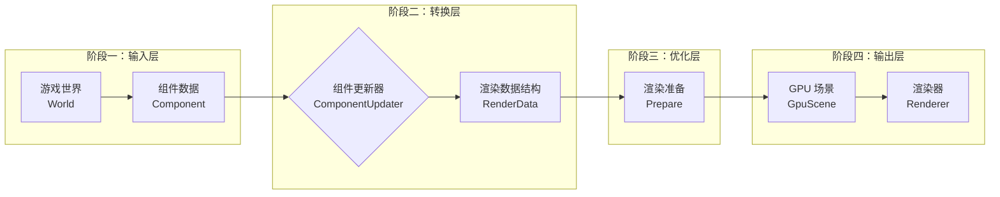

```mermaid
graph LR
    A[游戏世界 <br>World] --> B[组件数据 <br>Component]
    B --> C{组件更新器 <br>ComponentUpdater}
    C --> D[渲染数据结构 <br>RenderData]
    D --> E[渲染准备 <br>Prepare]
    E --> F[GPU 场景 <br>GpuScene]
    F --> G[渲染器 <br>Renderer]
    
    subgraph "阶段一：输入层"
        A
        B
    end
    
    subgraph "阶段二：转换层"
        C
        D
    end
    
    subgraph "阶段三：优化层"
        E
    end
    
    subgraph "阶段四：输出层"
        F
        G
    end

```

