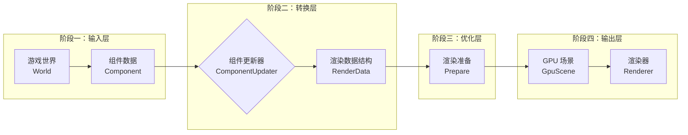

基于对 Zeta 引擎 Scene 类的分析，我来梳理一下完整的数据流向。整个流程可以分为 **四个主要阶段**，构成一个从游戏逻辑到 GPU 渲染的数据管道：


## 一、输入层：ECS 组件数据

**数据来源：**
```cpp
World* world_;                          // 游戏世界
const auto& entities = world_->get_entities();  // 所有实体
```

**关键组件类型：**
- `TransformComponent` - 变换信息（位置、旋转、缩放）
- `MeshComponent` - 网格数据
- `LightComponent` - 灯光数据（定向光、点光、聚光灯等）
- `PostProcessVolumeComponent` - 后处理体积
- `ParticleSystemComponent` - 粒子系统
- `CameraComponent` - 相机数据（通过 SceneView）

**数据特征：**
- **脏标记机制**：`is_dirty(EDirtyFlag::Render)` 标识数据变化
- **组件唯一 ID**：`ObjectId` 用于标识和查找
- **分层管理**：通过 TransformComponent 父子关系

## 二、转换层：组件更新器系统

### 1. 注册机制（静态映射）
```cpp
// 组件类型名称 → 更新函数
static std::unordered_map<std::string, ComponentRenderDataUpdater> component_updaters_;

// 注册内置组件更新器（在引擎初始化时调用）
Scene::register_builtin_component_updaters();
```

### 2. 更新流程（每帧执行）
```cpp
void Scene::update_component_render_datas() {
    // 遍历所有实体
    for (const auto& entity : entities) {
        ComponentUpdateContext ctx{this, entity, transform_component, nullptr};
        
        // 遍历实体所有组件
        for (const auto& [type_name, component] : entity->get_components()) {
            ctx.component = component;
            
            // 查找并调用注册的更新器（当数据变脏时）
            if (auto iter = component_updaters_.find(type_name); 
                iter != component_updaters_.end() && 
                (transform_component->is_dirty(EDirtyFlag::Render) || 
                 component->is_dirty(EDirtyFlag::Render) ||
                 component->get_type_name() == MeshComponent::get_static_type_name())) {
                
                iter->second(ctx);  // 调用组件特定的更新函数
                component->reset_dirty(EDirtyFlag::Render);
            }
        }
        transform_component->reset_dirty(EDirtyFlag::Render);
    }
}
```

### 3. 组件数据转换示例

**MeshComponent → MeshComponentRenderData:**
```cpp
void Scene::update_mesh_component(const ComponentUpdateContext& ctx) {
    MeshComponent* mesh_comp = static_cast<MeshComponent*>(ctx.component);
    
    // 1. 获取或创建渲染数据
    MeshComponentRenderData* render_data = 
        update_mesh_component_render_data(mesh_comp);
    
    // 2. 更新网格引用
    render_data->update_mesh(
        render_data_manager_->get_mesh_render_data(mesh_comp->get_mesh())
    );
    
    // 3. 设置组件属性
    render_data->component_info.component_id = mesh_comp->get_id();
    render_data->component_info.active = mesh_comp->is_active();
    render_data->component_info.cast_shadow = mesh_comp->is_cast_shadow();
    
    // 4. 更新材质
    update_sub_materials(mesh_comp->get_id(), mesh_comp);
}
```

**灯光组件 → LightRenderData:**
```cpp
void Scene::update_directional_light_component(const ComponentUpdateContext& ctx) {
    DirectionalLightComponent* light_comp = 
        static_cast<DirectionalLightComponent*>(ctx.component);
    
    // 存储到灯光渲染数据结构中
    light_render_data_.directional_lights[light_comp->get_id()] = *light_comp;
    light_render_data_.directional_light_infos[light_comp->get_id()] = 
        DirectionalLightInfo{/* 转换后的数据 */};
}
```

## 三、优化层：渲染准备与优化

### 1. 渲染数据结构整理
```cpp
// 各类渲染数据容器
LightRenderData light_render_data_{};
PostProcessRenderData post_process_render_data_{};
ParticleRenderData particle_render_data_{};
SkyAtmosphereRenderData sky_atmosphere_render_data_{};
SceneCaptureRenderData scene_capture_render_data_{};

// 网格渲染数据
std::unordered_map<ObjectId, MeshComponentRenderData> component_meshes_;
std::unordered_map<ObjectId, MaterialRenderData*> sub_materials_;
```

### 2. 子网格元素准备流程
```cpp
void Scene::update_sub_mesh_elements(SubMeshRenderElements& sub_mesh_render_elements) {
    // 1. 检查脏标记（仅在数据变化时处理）
    if (!mesh_render_dirty_) return;
    
    // 2. 遍历所有网格组件渲染数据
    for (auto& [component_id, component_mesh] : component_meshes_) {
        // 3. 视口过滤（根据显示标志）
        if (!render_show_flags.static_mesh && is_static) continue;
        if (!render_show_flags.skeletal_mesh && is_skeletal) continue;
        if (!render_show_flags.transparent_objects && is_transparent) continue;
        
        // 4. LOD 选择
        float screen_size = scene_view_->calc_screen_size(world_bounds);
        select_lod_level(screen_size_threshold, screen_size, component_mesh.lod_level);
        
        // 5. 创建渲染元素
        SubMeshRenderElement element;
        element.material = sub_materials_.at(material_id);
        element.sub_mesh = current_lod_sub_meshes[sub_index].get();
        element.component_info = component_info;
        
        sub_mesh_render_elements.emplace_back(element);
    }
    
    // 6. 智能排序（优化渲染性能）
    std::ranges::sort(sub_mesh_render_elements, [](const auto& lhs, const auto& rhs) {
        // 优先按混合模式（不透明→半透明）
        if (lhs.material->get_blend_mode() != rhs.material->get_blend_mode()) {
            return lhs.material->get_blend_mode() < rhs.material->get_blend_mode();
        }
        // 单面网格排在前面（优化背面剔除）
        if (lhs.component_info.manifold_mesh != rhs.component_info.manifold_mesh) {
            return lhs.component_info.manifold_mesh && !rhs.component_info.manifold_mesh;
        }
        // 按着色器变体 ID 排序（减少状态切换）
        return lhs.sub_mesh->get_shader_variant().get_id() < 
               rhs.sub_mesh->get_shader_variant().get_id();
    });
}
```

### 3. 性能优化策略

**A. 剔除系统：**
```cpp
// 粒子视锥剔除
void Scene::get_visible_particle_emitter(const Frustum& frustum) {
    for (auto& emitter : active_emitters_) {
        if (frustum.is_bounds_visible(emitter->get_bounds())) {
            emitter->set_is_culled(false);  // 可见
        } else {
            emitter->set_is_culled(true);   // 不可见
        }
    }
}
```

**B. LOD 系统：**
```cpp
void Scene::select_lod_level(const std::vector<float>& screen_size, 
                           float current_screen_size, 
                           uint32_t& lod_level) {
    // 1. 强制 LOD（调试用）
    if (force_lod_level_ > 0) lod_level = force_lod_level_;
    
    // 2. 组件强制 LOD
    if (lod_level > 0) return;
    
    // 3. 基于屏幕空间大小选择（阈值从大到小排列）
    lod_level = screen_size.size() - 1;  // 默认最粗糙
    for (uint32_t i = 0; i < screen_size.size(); ++i) {
        if (current_screen_size >= screen_size[i]) {
            lod_level = i;  // 选择更精细的 LOD
            return;
        }
    }
}
```

**C. 脏标记系统：**
- `mesh_render_dirty_` - 网格数据变化标记
- `EDirtyFlag::Render` - 组件渲染数据脏标记
- 只有数据变化时才重新处理和排序

## 四、输出层：GPU 渲染数据

### 1. GPU 场景更新
```cpp
void Scene::tick() {
    // ... 更新组件渲染数据
    
    // 更新 GPU 场景（虚拟几何体等高级特性）
    if (scene_view_ && scene_view_->view_config.render_show_flags.virtual_geometry) {
        gpu_scene_->tick(std::move(virtual_geometry_entities_));
    }
}
```

### 2. 渲染数据输出接口
```cpp
// 获取各类渲染数据供渲染器使用
auto get_light_render_data() { return &light_render_data_; }
auto get_post_process_render_data() { return &post_process_render_data_; }
auto get_particle_render_data() { return &particle_render_data_; }
auto& get_scene_capture_render_data() { return scene_capture_render_data_; }
```

### 3. 数据流总结表

| 阶段 | 输入数据 | 处理过程 | 输出数据 |
|------|----------|----------|----------|
| **输入层** | ECS 组件<br>TransformComponent<br>Mesh/Light 等 | 脏标记检查<br>组件遍历 | ComponentUpdateContext |
| **转换层** | ComponentUpdateContext | 组件更新器调用<br>数据格式转换 | 各种 RenderData 结构 |
| **优化层** | 原始渲染数据 | 剔除、LOD 选择<br>排序、过滤 | SubMeshRenderElements |
| **输出层** | 优化后的渲染数据 | GPU 场景更新<br>数据打包 | 渲染器可用的数据 |

## 五、数据流向特点

### 1. **异步友好的设计**
- 脏标记机制允许延迟更新
- 组件数据与渲染数据分离
- 可在工作线程执行部分处理

### 2. **内存友好的组织**
- 按渲染需求组织数据（按材质、混合模式）
- 减少缓存未命中（排序优化）
- 避免每帧重新分配内存

### 3. **扩展性强的架构**
- 组件更新器注册机制
- 支持自定义组件类型
- 插件式渲染特性（虚拟几何体）

### 4. **性能导向的优化**
- 按需更新（脏标记）
- 多级剔除（视锥、遮挡）
- 智能 LOD 选择
- 渲染状态排序

## 六、典型数据流转示例：一个网格的渲染

```
游戏逻辑层:
Entity[ID:100] → 
├─ TransformComponent (位置变化 → 标记为脏)
└─ MeshComponent (材质变化 → 标记为脏)

Scene 更新层:
1. tick() 调用 update_component_render_datas()
2. 检测到 TransformComponent 和 MeshComponent 的脏标记
3. 调用 update_mesh_component() 更新器
4. 更新 component_meshes_[100] 和 sub_materials_
5. 设置 mesh_render_dirty_ = true

渲染准备层:
1. 渲染器调用 update_sub_mesh_elements()
2. 因 mesh_render_dirty_ = true，重新处理所有网格
3. 计算屏幕空间大小，选择 LOD
4. 根据材质混合模式、单面网格、着色器变体排序
5. 生成 SubMeshRenderElements 列表

GPU 层:
1. 排序后的元素列表传递给渲染器
2. 按顺序提交 GPU 绘制命令
3. 减少状态切换和 Overdraw
```

这种数据流向设计确保了：
- **高效**：只在必要时更新数据
- **灵活**：支持多种渲染技术和扩展
- **可维护**：清晰的职责分离和模块化设计
- **性能**：多层次优化策略