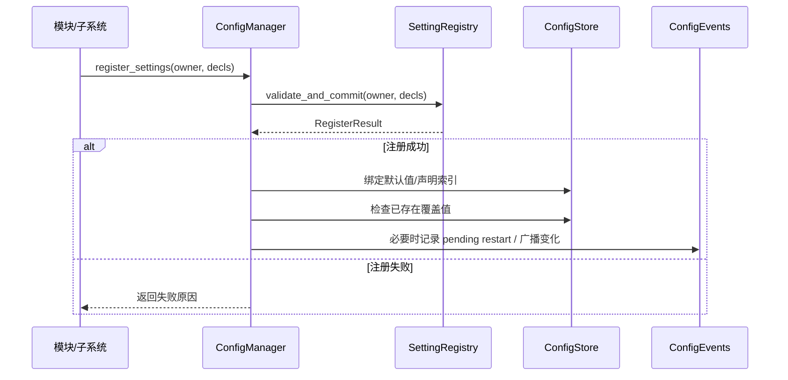

- [x] 日志添加Category
- [x] 日志文件自动切割，配置文件中配置单文件大小，和日志文件数量上限
- [ ] 性能测试找瓶颈，已知bloom性能较差
- [ ] 引擎代码中与编辑器相关逻辑添加WITH_EDITOR宏
- [ ] Chess项目重开后再走子（中间的兵），会出现渲染数据相关的崩溃
- [ ] 项目配置文件配置渲染特性
- [ ] 删除post_process_volume后移动镜头会导致崩溃
- [x] 检查曲线编辑器（移动）
- [ ] **添加全局设置系统（项目/编辑器），支持设置渲染、打包、编辑器等属性配置**

2026/5/6
合并dev分支到曲线编辑器代码
日志系统添加category

2026/5/7
日志文件自动切割，配置文件中配置单文件大小，和日志文件数量上限
修改category的一些实现，添加更多category
研究全局设置系统，可能需要ImReflect

2026/5/8
从新修改category的一些实现，禁用掉不传category的日志输出方式，修复不传category时的错误隐式构造问题
从新设计ConfigManager，初步实现全局设计系统，增加配置文件作用域（Engine，Project，User，Runtime），按模块注册并选择监听配置项

2026/5/9
review 移动outlinewindow的设计
2026/5/11

本周（5.11 - 5.15）：
（1）引擎底座开发
  1. 研究并完善全局设置系统
  2. 移除文件作用域概念，改为多源配置按优先级合并
  3. 添加可串联校验器、强类型支持
  4. 添加PropertyTree、PropertyPath，支持 `"themes.dark.colors[0].name"` 语法
（2）编辑器研发
	无
下周：
（1）引擎底座开发
  5. 全局设置系统，支持设置渲染特性
（2）编辑器研发
  无

2026/5/18
本周（5.11 - 5.15）：
（1）引擎底座开发
  1. 完善全局设置系统
  2. meta_core中添加通过反射判断相等的方法，解决clone时部分实体被标记Serialize脏位的问题
（2）编辑器研发
  3. outliner折叠状态改变不再显示World为脏，保存时依然会将折叠状态存入world
下周：
（1）引擎底座开发
  4. 全局设置系统
（2）编辑器研发
  配置系统设置界面