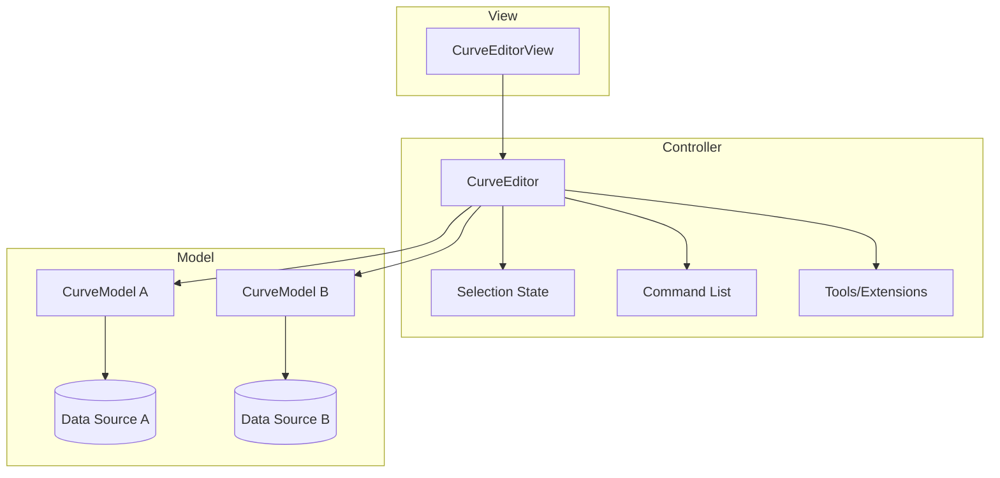

# 曲线编辑器系统设计文档

## 1. 引言

### 1.1 目的
本文档旨在描述一个通用、可扩展的曲线编辑器系统的设计。该系统允许用户以图形化方式编辑各种类型的曲线数据，并为不同数据源提供统一的操作接口。设计灵感来源于虚幻引擎的 `FCurveEditor` 和 `FCurveModel` 架构，重点解决数据多样性与编辑体验一致性之间的矛盾。
![[Pasted image 20260316150711.png]]
### 1.2 适用范围
本设计适用于需要在应用程序（如游戏引擎、动画工具、音频编辑器等）中集成曲线编辑功能的开发者。系统可被嵌入到现有编辑器框架中，并支持多种曲线数据类型（如浮点曲线、颜色曲线、变换曲线等）。

### 1.3 术语表
| 术语 | 解释 |
|------|------|
| 曲线编辑器 (Curve Editor) | 负责用户交互、视图管理和编辑状态的核心控制器。 |
| 曲线模型 (Curve Model) | 为具体曲线数据提供标准访问接口的适配器。 |
| 视图 (View) | 负责曲线可视化绘制和捕获用户输入的UI组件。 |
| 关键帧 (Key) | 曲线上定义值的点，包含时间、值及插值属性。 |
| 插值模式 (Interpolation Mode) | 定义关键帧之间如何计算中间值（如线性、曲线、恒定）。 |

## 2. 设计目标

- **统一编辑体验**：无论底层数据如何存储，用户面对的是相同的交互方式和视觉表现。
- **数据与表现分离**：曲线数据的存储与编辑逻辑解耦，允许独立演化。
- **可扩展性**：能够轻松添加对新曲线类型的支持，无需修改核心编辑器。
- **高性能**：支持大量曲线和关键帧的实时编辑与绘制。
- **复用性**：编辑逻辑、视图组件和工具可被不同场景复用。

## 3. 架构概述

系统采用经典的**模型-视图-控制器 (MVC)** 模式，并针对曲线编辑场景做了特化：

- **模型 (Model)**：`CurveModel` 抽象类，封装具体数据并提供统一接口。
- **视图 (View)**：`CurveEditorView`（或 `CurveEditorPanel`），负责绘制曲线和捕获用户输入。
- **控制器 (Controller)**：`CurveEditor` 类，管理编辑状态、选中集、交互命令及视图协调。

所有组件通过明确的接口通信，实现高内聚低耦合。

下图展示了系统的高层结构：

## 4. 核心组件详细设计

### 4.1 曲线编辑器 (CurveEditor)

**职责**：
- 管理所有已添加的曲线模型。
- 维护当前选中的关键帧/切线（通过 `Selection` 对象）。
- 处理用户交互命令（移动、缩放、复制、粘贴等），委托给曲线模型执行。
- 管理视图变换（平移/缩放）和坐标系转换。
- 提供扩展点（`EditorExtension`）和工具（`EditorTool`）注册机制。

**关键属性**：
- `TMap<CurveModelID, UniquePtr<CurveModel>> Curves`：持有的曲线模型集合。
- `FSelection Selection`：选中状态。
- `FViewTransform ViewTransform`：当前视图范围。
- `TArray<IEditorExtensionPtr> Extensions`：扩展列表。
- `TArray<IEditorToolPtr> Tools`：工具列表。

**关键方法**：
- `AddCurve(CurveModelPtr)`：添加曲线。
- `RemoveCurve(CurveModelID)`：移除曲线。
- `GetCurveModel(ID)`：获取指定曲线模型。
- `TransformScreenToValue(FVector2D ScreenPos)`：坐标转换。
- `ProcessMouseEvent(...)`：处理鼠标事件，转发给当前工具或默认交互。
- `DeleteSelectedKeys()`：删除选中关键帧。
- `CopySelectedKeys()` / `PasteKeys()`：复制/粘贴。

### 4.2 曲线模型 (CurveModel)

**职责**：
- 为具体数据源提供统一的操作接口。
- 管理曲线的显示属性（名称、颜色）。
- 负责将编辑器的修改应用到真实数据。
- 生成绘制所需的数据点。
- 创建关键帧代理对象（用于细节面板编辑）。
- 创建数据快照（用于复制/粘贴）。

**接口定义**（纯虚函数）：
- `int32 GetNumKeys() const`：获取关键帧数量。
- `void GetKeyPositions(TArrayView<KeyHandle> Handles, TArrayView<KeyPosition> OutPositions) const`：获取关键帧位置（时间/值）。
- `void SetKeyPositions(TArrayView<KeyHandle> Handles, TArrayView<KeyPosition> NewPositions, EChangeType ChangeType)`：设置关键帧位置。
- `void GetKeyAttributes(TArrayView<KeyHandle> Handles, TArrayView<KeyAttributes> OutAttributes) const`：获取关键帧属性（切线、插值模式等）。
- `void SetKeyAttributes(TArrayView<KeyHandle> Handles, TArrayView<KeyAttributes> NewAttributes, EChangeType ChangeType)`：设置关键帧属性。
- `TArray<KeyHandle> AddKeys(TArrayView<KeyPosition> Positions)`：添加新关键帧。
- `void RemoveKeys(TArrayView<KeyHandle> Handles)`：删除关键帧。
- `void DrawCurve(ICurveDrawParams& Params) const`：根据当前视图生成绘制点。
- `FText GetLongDisplayName() const`：获取曲线完整名称。
- `FLinearColor GetColor() const`：获取曲线颜色。
- `UObject* GetOwningObject() const`：获取拥有此曲线的对象（用于撤销/重做）。
- `TUniquePtr<IBufferedCurveModel> CreateBufferedCurveCopy() const`：创建数据快照。
- `TArray<UObject*> CreateKeyProxies(TArrayView<KeyHandle> Handles)`：创建关键帧代理对象。
- `bool IsReadOnly() const`：曲线是否只读。

**事件**：
- `FOnCurveModified OnCurveModified`：当曲线数据变化时广播，通知编辑器刷新视图。

### 4.3 视图组件 (CurveEditorView)

**职责**：
- 绘制曲线背景网格、坐标系、曲线线条和关键帧。
- 捕获鼠标/键盘事件并转发给 `CurveEditor`。
- 显示当前选中状态和工具提示。
- 管理视口滚动/缩放（通常与 `CurveEditor` 协作）。

**设计要点**：
- 视图本身不存储数据，仅从 `CurveEditor` 获取曲线模型进行绘制。
- 使用双缓冲或增量绘制保证流畅性。
- 提供缩放和平滑滚动支持。

### 4.4 关键帧代理 (Key Proxy)

当需要在属性面板中编辑关键帧的详细属性（如切线、插值模式）时，曲线模型可以创建代理对象。这些代理对象是瞬时的UObject，暴露属性给细节面板，并将修改写回曲线模型。

### 4.5 缓冲曲线模型 (BufferedCurveModel)

用于存储曲线状态的快照，通常用于复制/粘贴或预览操作。它包含关键帧位置、属性以及默认值，但不与原始数据关联。粘贴时，`CurveModel` 会根据快照创建新的关键帧。

## 5. 交互流程示例

以用户拖拽关键帧为例，说明组件间的协作：

1. **用户操作**：在 `CurveEditorView` 中点击并拖动一个关键帧。
2. **事件捕获**：视图将鼠标事件（位置、按钮状态）发送给 `CurveEditor`。
3. **命中测试**：`CurveEditor` 根据当前视图变换和曲线模型数据，确定被拖动的关键帧所属的曲线模型及关键帧句柄。
4. **开始事务**：`CurveEditor` 通知 `OwningObject` 开启一个撤销事务（如果支持）。
5. **更新位置**：`CurveEditor` 调用对应曲线模型的 `SetKeyPositions`，传入新的位置。
6. **数据修改**：曲线模型将新位置写入底层数据，并广播 `OnCurveModified` 事件。
7. **刷新视图**：`CurveEditor` 监听到事件后，通知 `CurveEditorView` 重绘。
8. **结束事务**：拖拽完成后，`CurveEditor` 结束撤销事务。

## 6. 扩展性设计

### 6.1 支持新曲线类型
要添加新的曲线类型，开发者只需：
- 实现一个继承自 `CurveModel` 的派生类，包装具体数据。
- 实现所有纯虚函数，将操作转发给底层数据。
- 在需要显示曲线的地方，创建该曲线模型的实例并添加到 `CurveEditor`。

### 6.2 自定义工具
通过实现 `IEditorTool` 接口，可以创建自定义编辑工具（如绘制工具、平滑工具）。工具可以访问 `CurveEditor` 的选中集和曲线模型，并响应鼠标事件。

### 6.3 编辑器扩展
通过 `IEditorExtension` 接口，可以添加自定义UI（如工具栏按钮、上下文菜单项）或修改编辑器行为。

## 7. 性能与内存考虑

- **绘制优化**：曲线模型应在 `DrawCurve` 中按需生成绘制点，避免每帧重新计算整个曲线。可缓存绘制点，仅在数据或视图变化时更新。
- **数据紧凑性**：底层数据存储应根据运行环境优化。运行时曲线应避免存储编辑器元数据，编辑器曲线则需保留完整信息。
- **关键帧批量操作**：所有接口均设计为批量操作（TArrayView），以减少虚函数调用次数和内存分配。
- **懒加载/快照**：`CreateBufferedCurveCopy` 应返回轻量级快照，避免复制大量数据。

## 8. 编辑器/运行时分离

**重要原则**：曲线模型本身应仅在编辑器环境中存在。运行时无需加载曲线模型类。底层数据（如 `FloatChannel`）应设计为纯数据容器，可以在运行时使用，而曲线模型仅在编辑时创建以支持交互。

## 9. 实现建议

- 使用**唯一标识符**（如 `CurveModelID`）引用曲线模型，避免悬挂指针。
- 关键帧使用**句柄**（`KeyHandle`）而非索引，以支持在编辑过程中关键帧顺序变化。
- 利用**观察者模式**：`CurveModel` 通过事件通知编辑器数据变化。
- 集成**撤销/重做系统**：通过 `GetOwningObject()` 获取数据拥有者，并利用事务系统记录更改。

## 10. 总结

本设计通过引入 `CurveModel` 抽象层，将曲线数据的多样性与编辑器核心分离，实现了一个灵活、可扩展且高性能的曲线编辑系统。它遵循 MVC 原则，使得开发者可以轻松地为新的数据源提供编辑支持，同时为用户提供一致且强大的交互体验。此架构已在虚幻引擎中得到验证，适用于各种需要曲线编辑的创意工具。