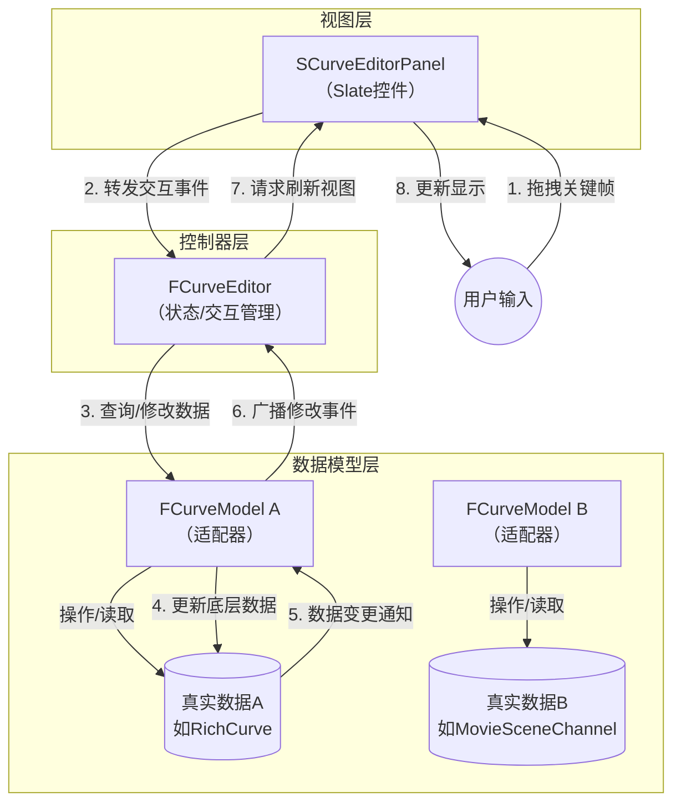
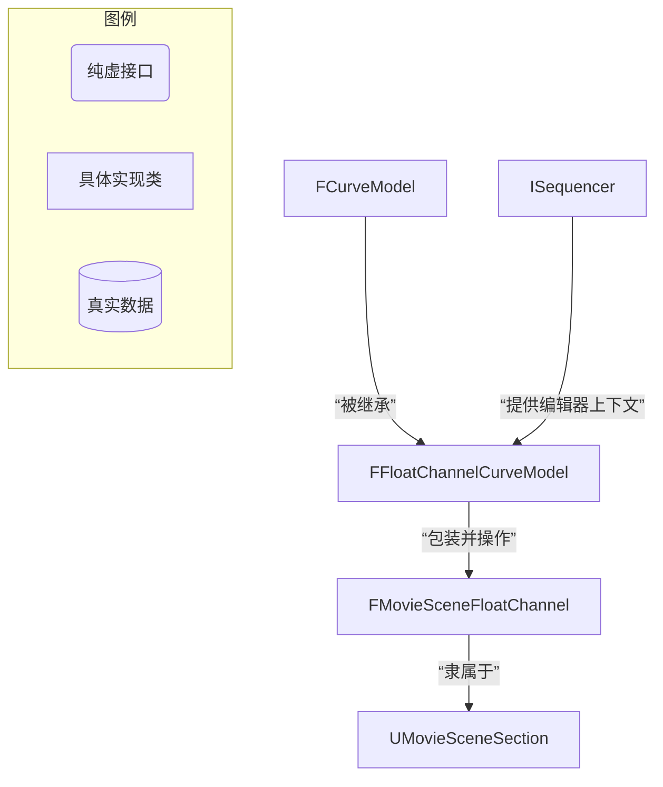

在虚幻引擎的曲线编辑器系统中，**`FCurveEditor` 和 `FCurveModel` 是一对紧密协作的核心类，它们共同遵循着经典的“模型-视图-控制器”设计模式，但在这里体现为一种“编辑器-数据模型”的分离架构。** 简单来说，`FCurveEditor` 是掌管用户界面交互和编辑状态的“大管家”，而 `FCurveModel` 则是为不同类型数据源提供统一访问接口的“数据适配器”。

下面我们来分别详细讲解它们的职责和协作方式。

### 🗺️ 概念核心：控制器与数据模型的分离

这个架构的核心目的在于**解耦**。`FCurveEditor` 不需要知道它正在编辑的数据是来自一个 `FRichCurve`、一个序列器轨道还是其他任何东西，它只需要通过 `FCurveModel` 这个标准接口来操作数据即可。这使得曲线编辑器本身成为一个高度可复用的UI组件。

### 🧭 1. FCurveEditor：总指挥部与视图状态管理器

`FCurveEditor` 类位于曲线编辑器系统的核心位置。它本身不存储具体的曲线数据，而是负责管理编辑器的全局状态、交互逻辑和与UI层的通信。

它的主要职责包括：

- **管理曲线集合 (`CurveData`)**：它内部有一个 `TMap<FCurveModelID, TUniquePtr<FCurveModel>>`，持有所有被添加到编辑器中的曲线模型。每个曲线模型都有一个唯一的 `FCurveModelID`。
- **管理选中状态 (`Selection`)**：通过 `FCurveEditorSelection` 对象，跟踪用户当前选中的是关键帧还是切线。
- **处理交互命令 (`CommandList`)**：持有UI命令列表，处理如复制、粘贴、删除、移动关键帧等操作。
- **管理视图和工具 (`Extensions`, `Tools`)**：支持通过扩展 (`ICurveEditorExtension`) 和工具 (`ICurveEditorToolExtension`) 来增强编辑器的功能。
- **管理缓冲曲线 (`BufferedCurves`)**：支持创建曲线状态的快照（缓冲），用于实现如粘贴、比较或特定编辑操作。
- **协调网格、轴和缩放**：提供屏幕空间转换、轴对齐、网格绘制等功能，这些都是UI层直接依赖的。

### 📦 2. FCurveModel：数据源的标准适配器

`FCurveModel` 是一个抽象基类，它扮演着数据源与编辑器之间的桥梁角色。它的核心作用是将各种不同的具体曲线数据（例如 `FRichCurve` 或序列器中的 `FMovieSceneFloatChannel`）包装成一个统一的接口，供 `FCurveEditor` 调用。

它的主要职责包括：

- **提供统一的增删改查接口**：定义了如 `GetNumKeys()`、`GetKeyPositions()`、`SetKeyPositions()`、`AddKeys()`、`RemoveKeys()` 等纯虚函数。无论底层数据如何存储，`FCurveEditor` 都通过这些方法进行操作。
- **提供绘制所需数据**：通过 `DrawCurve()` 方法，让曲线模型自己决定如何根据当前的屏幕空间生成用于渲染的插值点。
- **定义曲线外观**：存储曲线的显示颜色 (`Color`) 和显示名称 (`ShortDisplayName`, `LongDisplayName`)。
- **创建编辑代理**：`CreateKeyProxies()` 方法允许为特定的关键帧创建可编辑的UI代理对象，方便在细节面板中编辑其属性。
- **创建数据快照**：`CreateBufferedCurveCopy()` 用于创建一个轻量级的数据副本 (`IBufferedCurveModel`)，常用于实现复制粘贴或预览功能。

### 🔄 协作流程：一次编辑操作如何完成

为了更形象地说明，让我们通过一个用户交互的流程来看它们是如何协作的：

1.  **用户操作**：用户在UI上拖拽一个关键帧。
2.  **UI响应**：`SCurveEditorPanel`（曲线编辑器的Slate控件）捕获到鼠标事件。
3.  **编辑器决策**：`SCurveEditorPanel` 将事件转发给 `FCurveEditor` 实例，由后者根据当前激活的工具来决定如何处理。
4.  **数据操作**：`FCurveEditor` 确定需要修改哪个曲线上的哪些关键帧后，会通过对应的 `FCurveModel` 实例来执行操作，例如调用 `SetKeyPositions()`。
5.  **数据更新**：具体的 `FCurveModel` 实现（如 `FRichCurveEditorModelRaw`）将这次修改应用到其内部持有的真实数据（如一个 `FRichCurve` 指针）上。
6.  **界面刷新**：`FCurveModel` 在数据修改后广播 `CurveModifiedDelegate` 事件。`FCurveEditor` 监听到此事件，通知UI层刷新显示，用户便看到了关键帧位置的变化。

希望这个详细的讲解能帮助你理解这两个核心类的角色和关系。如果你对其中某个具体的功能（比如如何创建一个自定义的 `FCurveModel`）感兴趣，我们可以继续深入探讨。

